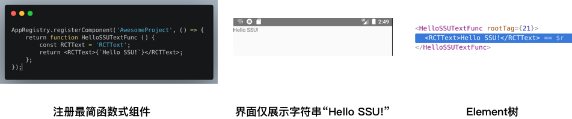

<!--# React 源码解析-->

职业生涯面临大前端转型，作为只会 Android 的我，笃信“ Talk is Cheap，Show me the Code”，ReactNative 无疑是业界优秀的开源项目，结合 Native 优势深耕 ReactNative，通过源码深入为主线攫取更多知识和技能。
我把 ReactNative 分为 React 和 Native 两部分，本篇是 React.js 源码解析。
源码解析，我一般是这样的：搭建本地可运行 Demo，通过 Debug 、Log 和 想象力交叉进攻，反复迭代。
让我们从一个简单的 Demo 开始。

# 简易 Demo

搭一个自己专属的游乐场--本地可运行环境（电脑macOS + 手机Android）。

1. 安装软件：Webstorm（前端开发环境）、AndroidStudio（Android开发环境，送Android模拟器）。
2. 安装依赖：安装Xcode（iOS开发环境，送iPhone模拟器）就顺带解决了。
2. 使用 React Native 命令行工具来创建一个名为"AwesomeProject"的新项目：`react-native init AwesomeProject`。
3. 欧了，[简单Demo](https://github.com/shengshuqiang/AdvanceOnReactNative/blob/master/AwesomeProject/App.js)，页面仅显示字符串“Hello SSU!”。<br><br>这里埋个小彩蛋，真实的 Demo 看到的 Element 树不会如此简洁，为了方便解析，我对 React.js 源码进行了魔改。
5. 更多配置详见[React Native 中文网-搭建开发环境](https://reactnative.cn/docs/getting-started.html)。

Demo 有了，接下来我们直奔主题。

# 源码

通过package.json文件获悉依赖源码版本。react 为 16.8.3，react-native 为 0.59.8。

* ReactNative 上层 JS 代码核心实现主要在 [ReactNativeRenderer-dev.js](https://github.com/shengshuqiang/AdvanceOnReactNative/blob/master/AwesomeProject/node_modules/react-native/Libraries/Renderer/oss/ReactNativeRenderer-dev.js)这一个文件中，约2W行代码（区区2W，好像压力也没辣么大）。
* [react.development.js](https://github.com/shengshuqiang/AdvanceOnReactNative/blob/master/AwesomeProject/node_modules/react/cjs/react.development.js)：纯 JS 侧React 相关定义和简单实现。
* [react.d.ts](https://github.com/shengshuqiang/AdvanceOnReactNative/blob/master/AwesomeProject/react.d.ts)：接口定义，详见本地目录/Applications/WebStorm.app/Contents/plugins/JavaScriptLanguage/jsLanguageServicesImpl/external/react.d.ts。

```
#  源码目录/Users/shengshuqiang/dream/AdvanceOnReactNative/AwesomeProject/node_modules
.
├── react
│   └── cjs
│       └── react.development.js # 纯 JS 侧 React 相关定义和简单实现
└── react-native
    ├── LICENSE
    └── Libraries
        ├── Components # 官方提供的各种组件，如 View、ScrollView、Touchable 等
        └── Renderer
            └── oss
                ├── GreateNavigationArt.js # “大海航术”核心实现，主要 hook 调用，打印调用栈日志和 dump Fiber 双树信息，约600行
                └── ReactNativeRenderer-dev.js # ReactNative 上层 JS 代码核心实现，约2W行

```

万事俱备了，当我们在谈论 React 时，我们在说什么？

# 概述

**什么是 React？**

[React](https://zh-hans.reactjs.org/)是用于构建用户界面的 JavaScript 库。简单说就是借助 React，开发者不需要一步步直接操作 DOM，而是直接告诉组件想要显示成什么样子。


图片源自[[译] 图解 React](https://juejin.im/post/5b481f6b51882519ad6175c2)。
上图非常形象的描述了这一点，为什么不直接告诉模特你想要的效果，而不是现在这样一步步地告诉他怎么摆 pose ?

**什么是 Component?**

[Component](https://zh-hans.reactjs.org/docs/glossary.html#components)，组件，是可复用的小的代码片段，它们返回要在页面中渲染的 React 元素。简单说是开发者操作的代码。

```
// 普通组件
class HelloSSUText extends React.Component {
    render() {
    	const RCTText = 'RCTText';
        return <RCTText>{`Hello SSU!`}</RCTText>;
    }
}
```

ES6 的 class 可以看作只是一个语法糖


